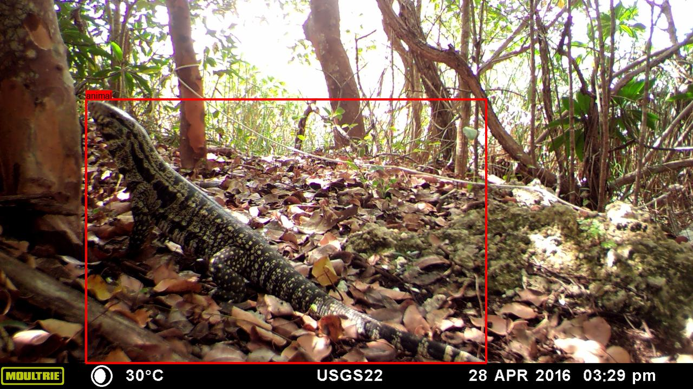

# USGS tegu detector

## Overview

The code in this repo trains, runs, and evaluates models to detect wildlife in camera trap images, particularly invasive [tegus](https://en.wikipedia.org/wiki/Tegu) in Florida.  This project is trained on data provided by the [USGS Fort Collins Science Center](https://www.usgs.gov/centers/fort-collins-science-center).



## Training the model

These are listed in roughly the order in which you would use them.


### Map annotations to images, and split images into train/val sets

This happens in [usgs-tegus-training-data-prep.py](usgs-tegus-training-data-prep.py).  This is the only script referred to in this README that does not live in this repo; it has all sorts of local paths in it and is kept in a separate repo.

This script does the following:

* Match labels in the USGS .csv file with images on disk
* Map species-level labels to category-level labels (e.g. collapsing rodent species into one category)
* Split locations into train/val
* Copy images out to train/val folers to prepare for further annotation and training

The input to this step is:

* The original image folder
* The original .csv file

The output at the end of this step will be a series of folders that look like this:

```console
- train
  - blank
  - tegu
  - crow
  ...
 
- val
  - blank
  - tegu
  - crow
  ...
```

Within those folders, each filename contains the species label, the remapped category label, the location ID, and the original full path, with '/' replaced by '#'.  E.g. this image:

`train/green_iguana/green_iguana#IgIg#11E.11_C102#2017-2019#C102_11E.11#(19) 26APR18 - 10MAY18 AMH ARB#MFDC6689.JPG`

...was at this location on the original disk:

`2017-2019/C102_11E.11/(19) 26APR18 - 10MAY18 AMH ARB/MFDC6689.JPG`


### Turn species-level labels into bounding boxes

* Run [MegaDetector](https://github.com/agentmorris/MegaDetector/) on the data, using test-time augmentation and aggressive repeat detection elimination.  Details of that process are outside the scope of this README.
* Convert MegaDetector results to the format used by [labelme](https://github.com/wkentaro/labelme/), using a slightly different threshold for each class (e.g. 0.4 for raccoons, where we know MD works quite well, but something like 0.1 for tegus).  This happens in [prepare-labelme-files-from-md-results.py](prepare-labelme-files-from-md-results.py). 
* Review every image in labelme (I'm specifically using [this fork of labelme](https://github.com/agentmorris/labelme)), fixing up any boxes that are broken/missing/etc.  Along the way, delete images where it's not possible to assign boxes (typically images where the animal isn't visible), and images with multiple species present (very rare).
* After manual cleanup of the data, review boxes to make sure they look sensible.

The input to this step is:

* Just the image folders written by the previous step, metadata is in folder names.

The output at the end of this step is:

* labelme-formatted .json files associated with each image, e.g., for the sample image referred to above:

`train/green_iguana/green_iguana#IgIg#11E.11_C102#2017-2019#C102_11E.11#(19) 26APR18 - 10MAY18 AMH ARB#MFDC6689.json`


### Convert to COCO format, and preview the COCO dataset to make sure everything still looks sensible

This happened via [labelme_to_coco.py](https://github.com/agentmorris/MegaDetector/blob/main/data_management/labelme_to_coco.py); the driver code is in [prepare-labelme-files-from-md-results.py](prepare-labelme-files-from-md-results.py).  Along the way, I also resized most images to 1600px on the long side in-place, with bounding boxes resized accordingly; this happened via [resize_coco_dataset.py](https://github.com/agentmorris/MegaDetector/blob/main/data_management/resize_coco_dataset.py).  At the end of this step, we do a complete resize operation on the whole database (images and .json).

The input to this step is:

* The train/val image folders (with copies of the images at their original sizes)
* The labelme .json files

The output from this step is:

* A copy of the train/val image folders in which everything has been resized to 1600px wide
* A COCO-formatted .json file containing all the train/val images and labels


### Convert to YOLO format, discarding a few classes, adding out-of-domain blanks

This happens in [prepare-yolo-training-set.py](prepare-yolo-training-set.py).  Specifically, this script does the following:

* Split the COCO-formatted data into train/val sets. This is not strictly necessary, it's just handy to have COCO files later for the train and val data separately.
* Previews the train/val sets to make sure everything looks sensible
* Converts to YOLO training format (YOLO-formatted annotations and a YOLOv5 dataset.yaml file).  As we do this, we also:
  * Sample blanks randomly
  * Exclude everything in the "blanks and very small things" folder that isn't blank: insects, tiny reptiles, etc.  I just decided to punt on these.
  * Exclude the "other" and "unknown" categories


### Add blanks from LILA

This happens in [add-lila-blanks.py](add-lila-blanks.py).  Blanks are originally fetched from LILA and organized via [create_lila_blank_set.py](https://github.com/agentmorris/MegaDetector/blob/main/data_management/lila/create_lila_blank_set.py), but the splitting into train/val and the resizing to 1600px for faster training happens here.


### Train

Training (using MDv5 as a starting point) happens at the CLI, but [train-usgs-tegu-detector.py](train-usgs-tegu-detector.py) tracks all the commands used to train.


### Postprocess and review results

[review-usgs-tegu-results.py](review-usgs-tegu-results.py) is a notebook that:

* Runs a trained model on the validation data
* Renders detections onto thumbnail images
* Generates confusion matrices and HTML preview pages to present the results

## Running the model

### Environment setup

#### Install prerequisites: Mambaforge, Git, and NVIDIA stuff

Install prerequisites according to the [MegaDetector instructions for prerequisite setup](https://github.com/agentmorris/MegaDetector/blob/main/megadetector.md#1-install-prerequisites-mambaforge-git-and-nvidia-stuff).  If you already have Mambaforge, git, and the latest NVIDIA driver installed, nothing to see here.

#### Download the model file and class list

* Download the model file.  As of the time I'm writing this README, the most recent model file is [usgs-tegus-yolov5x-231003-b8-img1280-e3002-best.pt](https://github.com/agentmorris/usgs-tegus/releases/download/v1.0.0/usgs-tegus-yolov5x-231003-b8-img1280-e3002-best.pt).  Download that file to your computer; it can be anywhere that's convenient, you'll specify the full path to the model file later.
* Download the accompanying dataset.yaml file, which indicates which model outputs (0, 1, 2, etc.) correspond to which categories (crow, tegu, etc.).  As of the time I'm writing this README, the dataset.yaml file is [here](https://github.com/agentmorris/usgs-tegus/releases/download/v1.0.0/dataset.yaml).

#### Python environment setup

These instructions are for Windows, but only in the sense that "c:\git" looks like a Windows path.  Other than the recommended folder, everything else is the same on Linux/MacOS.

The first time you set all of this up, open your Mambaforge prompt, and run:

```batch
mkdir c:\git
cd c:\git
git clone https://github.com/ultralytics/yolov5 yolov5-tegus
git clone https://github.com/agentmorris/usgs-tegus
cd c:\git\usgs-tegus
mamba create -n usgs-tegus python=3.11 pip -y
mamba activate usgs-tegus
pip install -r requirements.txt
```

<a name="windows-new-shell"></a>
Your environment is set up now!  In the future, when you open your Mambaforge prompt, you only need to run:

```batch
mamba activate usgs-tegus
set PYTHONPATH=c:\git\MegaDetector
```

### Actually running the model

You can run the model with the run_detector_batch script from the MegaDetector Python package, which you just installed.  First, when you open a new Mambaforge prompt, don't forget to do this:

```batch
mamba activate usgs-tegus
set PYTHONPATH=c:\git\MegaDetector
```

Then you can run the script like this (using Windows syntax), substituting real paths for all the arguments:

```batch
cd c:\git\MegaDetector\megadetector\detection
python run_inference_with_yolov5_val.py [MODEL_PATH] [IMAGE_FOLDER] [OUTPUT_FILE] --yolo_dataset_file [YOLO_DATASET_FILE] --yolo_working_folder "c:\git\yolov5-tegus"  --augment_enabled 0 --device 0
```

* MODEL_PATH is the full path to the .pt you downloaded earlier, e.g. "c:\models\usgs-tegus-yolov5x-231003-b8-img1280-e3002-best.pt"
* IMAGE_FOLDER is the root folder of all the images you want to process
* OUTPUT_FILE is the .json file that will contain model output
* YOLO_DATASET_FILE is the .yaml file you downloaded earlier

If you don't have a GPU, change this:

`--device 0`

...to this:

`--device cpu`


### Previewing the results

The .json file you just created will open in Timelapse, but if you want to preview the results in a browser, you can use:

```batch
cd c:\git\MegaDetector\megadetector\postprocessing
python postprocess_batch_results.py [OUTPUT_FILE] [OUTPUT_DIR] --image_base_dir [IMAGE_FOLDER] --n_cores 4 --open_output_file

* IMAGE_FOLDER is the same image folder you specified in the previous step
* OUTPUT_FILE is the .json file you created in the previous step
* OUTPUT_DIR is a folder in which you want to create an HTML preview

## TODOs 

* Since we're mostly interested in tegus, experiment with resampling the training data to reduce the number of raccoons and crows
* Combine the YOLOv5 and YOLOv8 outputs to maximize tegu F1
* Include other large-reptile datasets, likely lumping other reptiles (e.g. goannas) into the "tegu" class
* Hyperparameter optimization, in particular try freezing some layers during YOLOv8 training
* This is mostly a curiosity, but... it's unknown how much training benefits from using MD as a starting point; compare to training YOLOv5x6 from a COCO-trained starting point
* Maybe this whole approach is overkill; try training an image classifier rather than a detector
